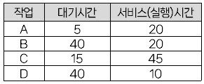

# 제1과목 : 소프트웨어설계(10/20)
# 제2과목 : 소프트웨어개발(11/20)
# 제3과목 : 데이터베이스구축(14/20)

## 41. 릴레이션 R의 차수가 4이고 카디널리티가 5이며, 릴레이션 S의 차수가 6이고 카디널리티가 7일 때 카티션프로덕트 

* 차수 4+6 = 10
* 카디너리 : 5 * 7 = 35


### Cartesian Product(교차곱)
속성(차수)은 더하고 카디너리는 곱한다 


## 42. 관계 대수 - 순수 관계 연산자
* 프로젝트
* 조인
* 디비전 


## 44. 기법 - Recovery
```
deferred modification
immediate update
shadow paging
check point
```


## 48. 제3정규형->BCNF가 되기 위한 조건

1,2,3 정규형 만족하고 
**결정자가 후보키가 아닌 함수종속 제거**


## 52. 트리의 차수 - 가장 많은 자식 노드의 개수 


## 53. sql - Intersection : INTERSECT(교집합)

* union : 합집합(중복제거)
* union all : 합집합(중복포함)


## 60. 개체-관계 모델(E-R)의 그래픽 

* 개체타입 - 사각형
* 속성 - 원형
* 관계타입 - 마름모
* 연결 - 선
※ 연결 삼각형 아님!!!


# 제4과목 : 프로그래밍언어활용(12/20)
## 61. 페이징 기법에서 페이지 크기가 작아지면 발생 현상
* 기억장소 이용효율 증가 
* 입출력시간 늘어남
* 내부 단편화 감소 
* 페이지 맵 테이블 크기 증가 


## 65. ISO - 네트워크 

* 패킷을 발신지-최종목적지까지 전달하는 책임
* 패킷에 발신지와 목적지 논리 주소 추가 
* 라우터 또는 교환기는 패킷 전달을 위해 경로 지정 또는 교환기능 제공

## 66. c
A=65, a=97 대문자가 더 작다!!!!!! **65 97** 암기!!!


## 67. 페이지 프레임 


## 69. C - mallloc()함수

* 실행시간에 힙 메모리를 할당 받음
* 실행하여 메모리를 할당 못받으면 NULL
* 할당 받은 메모리는 free()함수를 통해 해제 
* 인수로 **바이트** 단위의 정수를 전달 받아 메모리에 할당

## 71. 응집도 Cohesion
기순교 절시 논우

* 기능적(Functional)
* 순차적(Squential)
* 교환적(Communicational)
* 절차적(Procedural)
* 시간적(Temporal)
* 논리적(Logical)
* 우연적(coincidental)

## 72. 스케줄링 - HRN



```
우선순위 = (대기시간 + 서비스시간) / 서비스시간 

A = (5+20) / 20 = 1.25
B = (40+20) / 20 = 3
C = (15+40) / 45 = 1
D = (40+10) / 10 = 5
```

```
D->B->A->A
```


## 73. 교착상태 해결 - 은행원 알고리즘 - Avoidance

교착상태 발생 가능성을 인정하고 가능성을 피해감


### Prevention(예방)
사전에 시스템 제어하는 방식으로 자원 낭비 심함

### Detection(발견)
교착상태가 발행했는지 검사하여 프로세스와 자원을 발견 

### Recover(회복)
교착상태에 빠진 프로세스를 종료하거나 점유 자원을 선점하여 
다른 프로세스에게 할당 


## 78. Context Switching

다중 프로그래밍 시스템에서 OS에 의해 CPU가 할당되는 프로세스를 변경하기 위한 목적으로 현재 CPU를 사용하여 실행되고 있는 
프로세스의 상태정볼르 저장하고 제어권한을 ISR에 넘긴다 


## 79. TCP 프로토콜 

* 흐름 제어 기능을 수행
* 전이중(Full Duplex)방식으로 양방향 가상회선 제공 
* 전송데이터와 응답데이터를 함께 전송 

## 80. 오류제어 - 자동반복 요청방식(ARQ)

통신 경로에서 오류 발생시 수신측은 오류의 발생을 송신측에 통보하고 송신측은 오류가 발생한 프레임을 재전송하는 오류제어 방식

* stop-and-wait
* go-back-n 
* selective-repeat


# 제5과목 : 정보시스템구축관리(13/20)