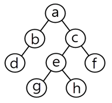

[cbtbank-220524](https://cbtbank.kr/category/%EC%A0%95%EB%B3%B4%EC%B2%98%EB%A6%AC%EA%B8%B0%EC%82%AC#google_vignette)

## 1. UML 다이어그램 중 순차 다이어그램

* 객체 간의 동적 상호작용을 시간 개념 중심으로 모델링
* 시스템의 정적 측면을 모델링
* 다이어그램의 수직 방향은 시간의 흐름
* 회귀 메세지(Self-Message), 제어블록(Statement block) 등으로 구성 

## 2. 메세지 지향 미들웨어(Message-Oriented Middleware, MOM)

* 메세지 기반의 비동기형 전달방식
* 이기종 분산 데이터 시스템의 데이터 동기를 위해 주로 사용
* 느리고 안정적인 메세지 전달을 보장하기 위한 미들웨어이며 
* 일정한 오버헤드 발생
* 상이한 애플리케이션 간 통신을 비동기 방식으로 지원
* 송신 측과 수신 측 연결 시 메세지 큐를 활용하는 방법이 있음

## 3. 익스트림 프로그래밍 

* 소규모 개발 조직이 불확실하고 변경이 많은 요구가 있을 때 적절한 방법
* 상식적인 원리와 경험을 최대로 끌어올리는 것
* 구체적인 실천방법을 정의, 개발문서보다는 소스코드에 중점


## 4. 유스케이스 구성요소 간의 관계 

* 연관(association)
* 포함(include)
* 확장(extend)
* 일반화(generalization)

※ 유스케이스 다이어그램 : 연관, 포함, 일반화, 확장
※ 클래스 다이어그램 : 연관, 포함, 일반화, 집합
※ 순차 다이어그램(구성요소) : 액터, 객체, 생명선, 실행상자, 메세지


## 5. 요구사항 분석 - 비기능적(Nonfunctional) 요구

시스템이 어떻게 동작해야하는지 설명하는 요구사항
(성능, 안정성, 보안 등의 시스템 품질과는 별개)


## 6. 정보공학 방법론 - 데이터베이스의 설계의 표현 모델링 언어

Entity-Relationshp Diagram

* 디비 설계에서 가장 일반적으로 사용하는 언어 
* 구조와 관계를 시각적으로 표현가능
* 개체와 관계 중심으로 모델링 


## 7. 미들웨어(Middleware)

* 여러 운영체제에서 응용 프로그램 사이에 위치
* 미들웨어의 서비스 이용을 위해 사용자가 정보 교환 방법 등의 내부 동작을 확인할 수 없어야 한다
* 소프트웨어 컴포넌트를 연결하기 위한 준비된 인프라 구조를 제공
* 여러 컴포넌트를 1대1, 1대다, 다대다 등 여러 가지 형태로 연결 가능 

## 8. UI 설계 지침 

* 이해하기 편하고 쉽게 사용할 수 있는 환경을 제공
* 주요 기능을 메인화면에 노출하여 조작이 쉽도록 
* 치명적인 오류에 대한 부정적인 사항은 사용자가 인지할 수 있도록
* 사용자의 믹무, 연령, 성별 등 다양한 계층을 수용하여야 함


## 9. 객체지향 개념 - 다형성(Polymorphism)

* 다형성은 현재 코드를 변경하지 않고 새로운 클래스를 쉽게 추가 
* 다형성이란 여러가지 형태를 가지고 있다는 의미로, 여러가지 형태를 받아들일 수 있는 특징을 말함
* 메소드 오버라이딩(overriding)은 상위 클래스에서 정의한 일반메소드를 하위 클래스에서 재정의 가능
* 메소드 오버로딩(overloading)은 동일한 메소드명에 매개변수나 타입을 다르게 재정의

## 10. 소프트웨어 개발 영역 결정 요소 - 인터페이스

* 소프트웨어에 의해 간접적으로 제어되는 장치와 소프트웨어를 실행하는 하드웨어
* 기존 소프트웨어와 새로운 소프트웨어를 연결하는 소프트웨어
* 순서적 연산에 의해 소프트웨어를 실행하는 절차 


## 11. 객체

* 객체는 상태, 동작, 고유 식별자를 가진 모든 것
* 
* 객체는 필요한 자료 구조와 이에 수행되는 함수들을 가진 하나의 독립된 존재 
* 객체의 상태는 속성값에 의해 정의


## 0. 개체(Entity)와 객체(object)의 차이

개체 : 현실 세계에서 고유한 속성을 가지는 대상을 의미(데이터 모델)
DB, ERD, 개념모델링 등에서 주로 사용
고유한 식별자(PK), 특정 속성을 가짐
보통 정적인 데이터를 나타냄 
관계를 정의하는데 사용(학생-수업 관계)


객체 : OOP에서 속성과 행동을 가진 존재(메소드)
현실 세계의 개체를 소프트웨어적으로 구현한 것
상태(State), 행위(Behavior)를 가짐
클래스 기반으로 생성
실행 중 변화 가능한 동적인 존재 


요약 : 개체는 현실세계의 데이터 모델, 객체는 소프트웨어로 구현한 개체


## 12. 객체지향 개념 - Encapsulation 

* 속성과 관련된 연산(Operation)을 클래스 안에 묶어서 하나로 취급하는 것을 의미
* 속성과 연산이 서로 영향을 주지 않고 독립적으로 작동
* 코드의 가독성과 유지보수성 향상

※ 상속(Inheritance) : 이미 정의된 상위 클래스의 모든 속성과 연산을 하위클래스가 물려받음
※ 클래스 : 하나 이상의 유사한 객체들을 묶음
※ 캡슐화(Encapsulation) : 서로 관련성이 많은 데이터들과 연산들을 묶음
※ 연관관계(Association) : 2개 이상의 사물이 서로 관련이 있음을 표현

## 13.  애자일(Agile) 프로세스 모델

* 변화에 대응하는 소프트웨어 개발
* 개개인과 상호소통을 통해 의견수렴
* 고객과의 협력을 중요시
* 실행가능한 소프트웨어 중심


## 14. Component

* 명백한 역할을 가지고 독립적으로 존재할 수 있는 시스템의 부분
* 재사용되는 모든 단위
* 인터페이스를 통해서만 접근

## 15. 디자인패턴 - GoF(Gang of Four)

### 생성 패턴 : 객체를 생성하는 것에 대한 패턴

* 추상 팩토리(abstract factory)
* 빌더(builder)
* 팩토리 메소드
* 프로토타입
* 싱글톤


### 구조 패턴 : 구조를 통해 확장성을 염두하는 패턴

* 어댑터
* 브릿지
* 컴포넌트
* 데코레이터
* 퍼사드(facade)
* 플라이웨잇(flyweight)
* 프록시(proxy)

### 행동 패턴 : 행위의 변경, 수정 등을 위한 패턴

* 역할사슬|책임연쇄(chain of reposibility)
* 커맨드
* 인터프리터
* 이터레이터(반복자)
* 미디에이터(중재자)
* 메멘토(memento)
* 옵저버
* 상태(state)
* 전략(strategy)
* 템플릿 메소드
* 비지터(visitor) 

## 16. UI 기본 개념 - FeedBack

시스템의 상태와 사용자의 지시에 대한 효과를 보여주어 사용자가 명령에 대한
진행상황과 표시된 내용을 해석할 수 있도록 도와주는 것


## 17. UI 종류 - NUI(Natural User Interface)

멀티터치, 동작인식 등 사용자의 자연스러운 움직임을 인식하여 서로 주고받는 정보를
제공하는 사용자 인터페이스를 의미 


## 18. 소프트웨어 모델링

* 모델링 작업의 결과물은 다른 모델링 작업에 영향줌
* 구조적 방법론에서는 DFD(Data Flow Diagram), DD(Data Dictionary) 등을 사용하여 요구사항 결과 표현
* 객체지향 방법론에서는 UML 표기법 사용
* 소프트웨어 모델을 사용할 경우개발될 소프트웨어에 대한 이해도 및 이해 당사자 간의 의사소통 향상에 도움이 됨


## 19. 유스 케이스 - Use Case Diagram

* 시스템과 상호작용하는 외부시스템은 액터로 파악
* 유스케이스는 사용자 측면에서의 요구사항, 사용자가 원하는 목표 달성을 위해 수행할 내용을 기록
* 시스템 액터는 다른 프로젝트에서 이미 개발되어 사용되고 있으며, 본 시스템과 데이터를 주고 받는 등 서로 연동되는 시스템을 말함
* 액터가 인식할 수 없는 시스템 내부의 기능을 하나의 유스케이스로 파악해서는 안됨

## 20. MVC

* MVC모델은 사용자 인터페이스를 담당하는 계층의 응집도를 높이고, 여러개의 다른 UI를 만들어 그 사이에 결합도를 낮출 수 있음
* 모델은 뷰와 컨트롤러와 독립적으로 존재하며 데이터 비지니스 로직을 처리하는 역할(독립적 중재자)
* 뷰는 모델에 있는 데이터를 사용자 인터페이스에 보이는 역할
* 컨트롤러는 모델에 명령을 보내 모델의 상태를 변경


## 21. 통합 테스트(Integration)
* 시스템을 구성하는 모듈의 인터페이스와 결합을 테스트
* 하향식 통합 테스트의 경우 넓이우선(Breadth First) 방식으로 테스트할 모듈 선택
* 상향식 통합테스트의 경우 하위모듈부터 순차적으로 진행(모듈간의 의존성 고려)
* 모듈간의 인터페이스와 시스템의 동작이 정상적인지 빨리 파학할 때는 하향식 통합 테스트

## 22. 이진 검색 방법 - 14를 찾아라 
```
1 2 3 4 5 6 7 8 9 10 11 12 13 14 15
```

### 1단계
* 배열의 크기 : 15
* 가운데 인덱스 : (0+14) // 2 = 7
※ (탐색범위 시작인덱스 + 종료인덱스) // 2 
* 중앙값 : 8
* 14 > 8 오른쪽 탐색

### 2단계
```
9 10 11 12 13 14 15
```
* 가운데 인덱스 : (8+14) // 2 = 11
* 중앙값 : 12
* 14 > 12 오른쪽 탐색

### 3단계
```
13 14 15
```
* 가운데 인덱스 : (12+14) // 2 = 13
* 중앙값 : 14
* 14 == 14 찾음

## 0. 이진 탐색 문제 - 26 찾기 

### 1단계 
```
[5, 9, 13, 17, 21, 26, 32, 38, 44, 50]
```
* 가운데 인덱스 : (0+9) // 2 = 4
* 중앙값 : 21
* 26 > 21 오른쪽 탐색 

### 2단계 
```
[26, 32, 38, 44, 50]
```
* 가운데 인덱스 : (5+9) // 2 = 7
* 중앙값 : 38
* 26 < 38 왼쪽 탐색

### 3단계 
```
[26, 32]
```
* 가운데 인덱스 : (6+7) // 2 = 6
* 중앙값 : 26
* 26 == 26 


## 23. 소프트웨어공학 - Walkthrough
* 사용사례를 확장하여 명세하거나 설계 다이어그램, 원시코드 테스트케이스 등에 적용할 수 있다
* 복잡한 알고리즘 또는 반복, 실시간 동작, 병행처리와 같은 기능이나 동작을 이해하려고 할 때 유용
* 인스펙션과는 다른 의미다 
* 단순한 테스트 케이스를 이용하여 프로덕트를 수작업으로 수행해보는 것  
※ 인스펙션 : 검토 대상에 대한 이해도를 높이기 위해 작성자나 다른 팀원들이 설명하면서 진행하는 검토 방법론
엄격하고, 체계적인 검토 방법으로 미리 정해진 규칙에 따라 수행 


## 24. 소프트웨어 개발과정 - 형상관리

소프트웨어의 변경사항을 관리하기 위해 개발된 일련의 활동 

## 25. 테스트케이스 

* 테스트의 목표 및 방법을 결정 후 테스트 케이스 작성
* 결함이 있더라도 입력에 대해 정상적인 결과를 낼 수 있기 때문에 결함을 검사할수 있는 테스트 케이스를 찾는 것이 중요
* 개발된 서비스가 정의된 요구사항을 준수하는지 확인하기 위한 입력값과 실행 조건, 예상결과의 집합
* 테스트 케이스 실행이 통과되었는지 실패하였는지 판단하기 위한 기준을 테스트 오라클(Test Oracle)이라고함

## 26. 객체지향
* 객체란 필요한 자료 구조와 수행되는 함수들을 가진 하나의 독립된 존재하며
* JAVA에서 정보은닉(Information Hiding)을 표기할 때 private는 비공개의 의미
* 상속(Inheritance)은 개별 클래스를 상속관계로 묶음으로써 클래스 간의 체계화된 전체 구조를 파악하기 쉽다
* 같은 클래스에 속하는 개개의 객체이자 하나의 클래스에서 생성된 객체를 인스턴스라고 한다

## 27. DRM(Digital Rights Management)
* 디지털 콘텐츠와 디바이스의 사용을 제한하기 위해 하드웨어 제조업자, 저작권자, 출판업자 등이 사용할 수 있는 접근제어 기술
* 디지털 미디어 생명주기동안 발생하는 사용권한 과금, 유통단계를 관리하는 기술
* 클리어링 하우스(Clearing House)는 사용자에게 콘텐츠 라이센스를 발급하고 권한을 부여하주는 시스템을 말한다
* 원본을 안전하게 유통하기 위한 전자적 보안을 고려하여 불법유통과 복제의 방지가 가능하다

## 28. 위험 모니터링

위험 요소 징후들에 대하여 계속적으로 인지하는 것 

## 29. 버전관리도구 - RCS(Revision Control System)

동시에 소스를 수정하는 것을 방지하며 다른 방향으로 진해오딘 개발 결과를 합치거나 
변경내용을 추적할 수 있는 소프트웨어 버전관리도구

## 30. 화이트박스 테스트

* 화이트박스 테스트의 이해를 위해 논리흐름도(Login-Flow Diagram)를 이용할 수 있다
* 테스트데이터를 이요해 실제 프로그램을 실행함으로써 오류를 찾는 동적테스트(Dynamic Test)
* 화이트박스 테스트는 내부 구조를 고려하여 테스트를 수행하므로 프로그램의 코드, 제어흐름, 논리경로 등을 기초로 결정
* 테스트데이터를 선택하기 위하여 검증기준(Test Coverage)을 정한다


## 0. 화이트/블랙 박스 테스트 

### 화이트박스 테스트
```
프로그램의 내부 코드, 구조, 논리를 확인하는 테스트 기법
```
* 소스 코드의 흐름과 로직을 직접 분석하여 테스트 케이스 작성
* 조건문, 루프, 분기문 등을 테스트하여 코드의 경로를 검증
* 보통 개발자가 수행하며 유닛테스트 단계에서 많이 사용 
※ 제어문, 반복문, 분기문 등이 잘 작동하는지 

### 블랙박스 테스트
```
프로그램의 내부 코드를 보지 않고, 요구사항과 기능을 기반으로 하는 테스트 기법
```
* 프로그램이 예상한 입력을 받았을 때 올바를 출력을 하는지
* 사용자 관점에서 테스트하며 기능중심(Functional Testing)의 테스트 해당
* 보통 QA나 최종 사용자가 수행
※ 로그인이 잘작동하는지, 비정상데이터 입력시 오류 발생하는지


## 31. 알고리즘
* 주어진 작업을 수행하는 컴퓨터 명령어를 순서대로 나열한 것으로 볼 수 있다
* 검색은 정렬되어있지 않은 데이터 혹은 정렬이 된 데이터 중에서 키값에 해당되는 데이터를 찾는 알고리즘
* 정렬은 흩어져있는 데이터를 키값을 이용하여 순서대로 열거하는 알고리즘이다
* 선형 검색은 검색 수행 전 데이터의 집합이 정렬되어 있지 않아도 괜찮다~

## 32. 버블 정렬(Bubble Sort)

버블 정렬은 인접한 두 개의 값을 비교하여 큰 값을 오른쪽시키는 방식으로 동작하며 N-1번 PASS 수행 

```
[9, 6, 7, 3, 5]
```

### PASS 1

#### 9, 6을 비교
```
[6, 9, 7, 3, 5]
```

#### 9, 7을 비교
```
[6, 7, 9, 3, 5]
```

#### 9, 3을 비교
```
[6, 7, 3, 9, 5]
```

#### 9, 5을 비교
```
[6, 7, 3, 5, 9]
```

## 33. 인스펙션(Inspection)

* 1. 계획
* 2. 사전교육(오리엔테이션)
* 3. 준비
* 4. 인스펙션 회의(검토 회의)
* 5. 수정(재작업)
* 6. 후속조치
* 7. 완료 


## 34. 소프트웨어 개발 및 시스템 설계 - Refactoring

소프트웨어를 보다 쉽게 이해할 수 있고 적은 비용으로 수정할 수 있도록 겉으로 보이는 동적의 변화 없이 내부 구조를 변경하는 것


### Architecting
* 소프트웨어 또는 시스템의 구조를 설계하는 과정
* 구성요소(모듈), 인터페이스, 데이터흐름, 상호작용을 정의
* 성능, 확장성, 보안, 유지보수성을 고려 

### Specification(명세)
* 소프트웨어나 시스템이 가져하할 기능, 요구사항, 제약 조건 등을 문서화 한 것
* 명확한 기능 정의를 통해 개발 및 검증 과정에서 오해를 방지
* 기능명세(FRS), 비기능명세(NFR), 기술명세(TDS) 등이 포함

### Renewal(갱신, 개편, 리뉴얼)
* 기존 시스템, 소프트웨어, 아키텍쳐, 디자인 등을 개선 또는 변경하는 과정
* 성능 개선, 최신 기술 적용, 사용자 경험 상향
* 완전한 재개발이 아니라 리팩토링, 마이그레이션, 업그레이드도 포함 


## 35. 단위테스트(Unit Test)

* 구현 단계에서 각 모듈의 개발을 완료한 후 개발자가 명세서의 내용대로 정확히 구현되었는지 테스트
* 모듈 내부의 구조를 구체적으로 볼 수 있는 구조적 테스트를 주로 시행
* 테스트 드라이버는 필요데이터를 인자를 통해 **넘겨주고**, 테스트 완료 후 그 결과값을 받는 가상의 모듈
* 테스트할 모듈을 호출하는 모듈도 있고, 테스트할 모듈이 호출하는 모듈도 있다 

* 테스트 스텁은 인자를 통해 **받은 값을** 가지고 수행한 후 그 결과를 모듈에게 넘겨주는 역할


### 테스트 드라이버 
* 테스트하려는 모듈을 호출하는 상위 모듈
* 테스트하고자하는 모듈이 의존하는 상위모듈을 임시구현
* 테스트할 하위 모듈을 직접 실행할 수 없을 때 

※ 상위 모듈이 하위 모듈을 호출하는 구조에서 하위모듈이 구현되지 않았을 때 상위 모듈을 테스트 드라이버로 만들어 하위 모듈을 가짜 함수로 대체하여 간접적으로 테스트 


### 테스트 스텁 
* 하위모듈의 기능을 대체하는 가짜 구현체 
* 테스트하고자하는 모듈의 하위 모듈을 미리 구현된 가짜 코드 


## 36. IDE(Integrated Development Enviroment) 도구

* 코딩 : 프로그래밍 언어를 가지고 컴퓨터 프로그램을 작성할 수 있는 환경을 제공 
* 컴파일 : 고급언어로 작성된 코드를 저급언어로 변환
* 디버깅 : 프로그램에서 발견된 버그를 찾아 수정할 수 있는 기능
* Deployment : 소프트웨어를 최종 사용자에게 전달하기 위한 기능 


## 37. 후위순회(Posrtorder) - 좌우상
왼쪽 자식 - 오른쪽 자식 - 부모 


* d - - g - h - e - f - c - a

## 38. JSON

인터페이스 구현시 사용하는 기술로 속성-값쌍(Attribute-Value Pairs)으로 이루어진 데이터 오브젝트를 전달하기 위해 사용하는 개방형 표준 포맷


## 39. Stack(리포, 후입선출)

순서가 있는 리스트에서 데이터의 삽입(push), 삭제(pop)가 한쪽 끝에서 일어나며 LIFO(Last In First Out)의 특징을 가지는 자료구조

※ 브라우저 뒤로가기, 재귀함수 호출스택, undo
※ 지역변수, 함수호출주소, 매개변수, 연산 중간값, 리터럴

### Queue(피포, 선입선출)

삽입(Enqueue)은 뒤(Rear)에서, 삭제(Dequeue)는 앞(front)에서 수행하며 

※ 은행 번호표 시스템, 프린터 작업 대기열, 네트워크 패킷 
※ OS 프로세스 스케줄링, 이벤트 처리 시스템, 메세지큐, 스트리밍 버퍼 

### Tree
* 계층적 구조를 가지는 비선형 자료구조
* 부모-자식 관계가 있으며 루트 노드에서 시작
* 이진트리, 이진탐색트리, 힙, 트라이

※ 파일 시스템(디렉토리 구조), HTML DOM, 디비 B-Tree 인덱스


### Graph

* 노드(Node, 정점)와 간선(Edge)으로 구성된 자료구조

* 사이클이 존재할 수도 있고, 방향성이 있을 수 있음

* 유향(Directed)그래프, 무향(Undirected)그래프, 가중(Weighted)그래프, 비가중(Unweighted)그래프

※ 소셜 네트워크, 지도 네비, 웹페이지 링크구조 


## 40. 테스트 도구 

* CppUnit : c++
* JUnit : Java
* HttpUnit : 웹애플리케이션


## [중요] 41. 정규형(Normal Form) - BCNF(Boyce-Codd Normal Form)

* 테이블 R에 속한 모든 도메인이 원자값으로만 구성
* 테이블 R에서 키가 아닌 모든 필드가 키에 대해서 함수적으로 종속되며, 키의 부분 집합이 결정자가 되는 부분 종속이 존재하지 않는다
* 테이블 R에 존재하는 모든 함수적 종속에서 결정자가 후보키이다


### 정규형(Normal Form)이란?
데잍어베이스에서 이상(Anomaly)을 방지하고 데이터 무결성(Integrity)을 무지하기위해 테이블을 구조적으로 정리하는 방법

### 정규형의 종류 

#### 제1정규형(1NF)
* 모든 속성이 **원자값(Atomic Value)**를 가져야 한다
* 중복된 컬럼이나 반복되는 그룹이 없어야 한다
* 예시 : 전화번호를 개별의 행으로 나눠야 한다 
```
{ "전화번호": ["010-1234-5678", "02-9876-5432"] }
```
※ Atomic Value : 디비에서 더 이상 나눌 수 없는 최소 단위의 값을 말함, 하나의 필드에는 하나의 값만 저장 

#### 제2정규형(2NF)
* 1NF를 만족하면서 **부분 함수 종속(Partial Dependency)**이 없어야 함
* 기본 키의 일부에만 의존하는 속성을 제거해야 함

* 예시 : 과목명과 교수명이 과목코드에 종속되면 분리해야함 
```
{ 학번, 과목코드, 과목명, 교수명 }
```

#### 제3정규형(3NF)
* 2NF를 만족하면서 **이행적 함수 종속(Transitive Dependency)**이 없어야함
* 키가 아닌 모든 속성이 직접적으로 기본키에만 의존해야함
* 예시 
{ 학번 → 학과코드, 학과코드 → 학과명 } → 학과코드가 후보키가 아니라면 학과명을 다른 테이블로 분리해야 함.


#### BCNF(Boyce Codd Normal Form)

* 3NF를 만족하면서 모든 함수적 종속에서 결정자가 반드시 후보키어야함
* 예시: { 교수명 → 강의실번호, 강의실번호 → 과목 } 같은 경우, 교수명이 후보키가 아니라면 BCNF를 위반함.


#### 정규화 - 주요 키워드 정리 
* 1NF : 원자값, Atomic Value
* 2NF : 부분 함수 종속(Partial Dependency) 없어야함
* 3NF : 이행적 함수 종속(Transitive Dependency)이 없어야 함, 기본키에 의존 
* BCNF : 모든 함수적 종속에서 결정자가 반드시 후보키여야 함.


### 42. 데이터베이스 - 트랜잭션 - Atomicity(원자성)
트랜잭션의 모든 연산들이 정상적으로 수행완료 되거나 아니면 전혀 어떠한 연산도 수행하지 않은 원래의 상태가 되어야 한다

#### ACID 속성

* Atomicity(원자성) : 트랜잭션이 완전이 수행(Commit)되거나 아예 수행되지 않아야(Rollback)함
* Consistency(일관성) : 트랜잭션이 실행된 후에도 데이터가 일관된 상태를 유지 
* Isolation(고립성) : 여러 트랜잭션이 동시에 실행되더라도 서로 간섭하지 않아야 함
* Durability(지속성) : 트랜잭션이 성공적으로 수행되면 결과가 영구적으로 저장되어야함 

